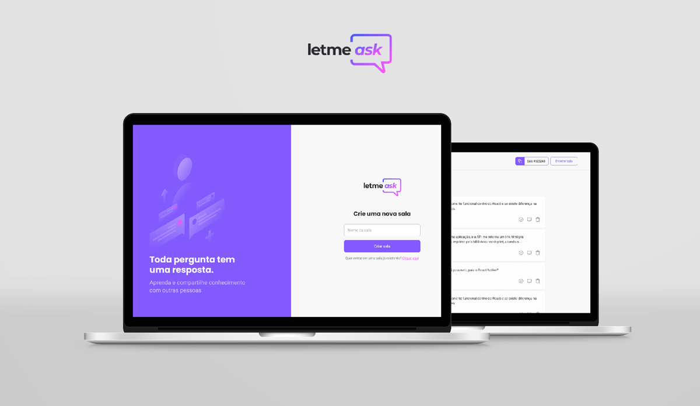

# NEXT LEVEL WEEK #6 TOGETHER  🚀



## ❇️ Projeto 
Aplicativo web onde o usuário pode criar salas exclusivas para perguntas e respostas durante aulas onlines. 


Bloco de notas → [Clique para ver anotações](https://www.notion.so/NLW-6-together-d2ec7ecb27ae41ce8dbef98512b37676)

## ⚛️ Tecnologias 
- React
  - para frontend da aplicação.
  - uso de Typescript.
  - uso de Sass para estilo de páginas.
- Firebase
  - Registro e login com autentificação do Google.
  - alteração de banco de dados realtime.

## ▶️ Como executar

Faça a cópia do projeto(clone), insira código abaixo no terminal e acesse a pasta:
```
$ git clone https://github.com/eessgg/NLW-6together.git
$ cd NLW-6together
$ 
```
Para iniciá-lo, siga os passos abaixo:
```
# Instalar as dependências
$ cd client
$ yarn

# Iniciar o projeto
$ yarn start
```
O app estará disponível no seu browser pelo endereço http://localhost:3000.

Lembrando que será necessário criar uma conta no Firebase e um projeto para disponibilizar um Realtime Database.


## ✅ License
Esse projeto está sob a licença MIT. Veja o arquivo [LICENSE](LICENSE.md) para mais detalhes.
